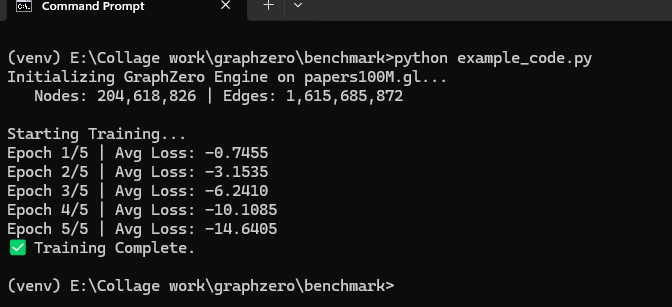
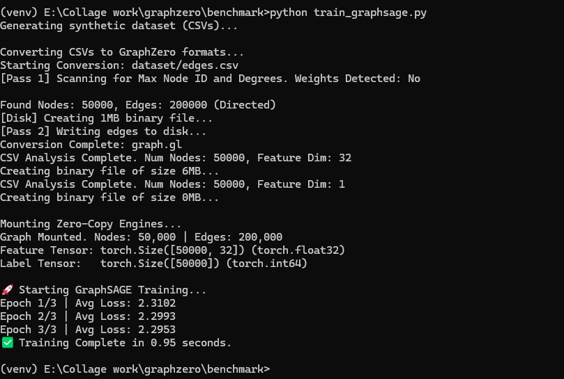

# GraphZero API Reference 📘

This document details the Python API exposed by the `graphzero` C++ engine.

## 📦 Core Class: `Graph`

The main entry point for interacting with the graph.

```python
import graphzero as gz
g = gz.Graph("path/to/graph.gl")

```

### Properties

| Property | Type | Description |
| --- | --- | --- |
| `g.num_nodes` | `int` | Total number of nodes in the graph. |
| `g.num_edges` | `int` | Total number of edges (directed). |

### Methods

#### `get_degree(node_id: int) -> int`

Returns the out-degree (number of neighbors) for a specific node.

* **Usage:** checking if a node is a dead-end before walking.

#### `get_neighbours(node_id: int) -> numpy.ndarray`

Returns a **1-D numpy ndarray** of neighbour node IDs (dtype: `np.int64`). This is returned from the C++ layer as a fast zero-copy buffer and can be used directly with NumPy/PyTorch.

* **Notes:**
  - The binding uses the British spelling `get_neighbours` (this is the function name exposed in the Python API).
  - For very high-degree nodes prefer `sample_neighbours` or `batch_random_fanout` to avoid copying large arrays.

---

### 🎲 Sampling Methods (The Engine)

These functions use OpenMP multithreading on the C++ side and release the GIL to fully saturate CPU/disk bandwidth. All batch functions return a **NumPy ndarray** of dtype `np.int64`.

#### `batch_random_walk_uniform(start_nodes: List[int], walk_length: int) -> numpy.ndarray`  

**The Speed King.** Performs unbiased uniform random walks.

* **Return shape & dtype:** `ndarray` with shape `(len(start_nodes), walk_length)` and dtype `np.int64`.
* **Algorithm:** At every step, pick a neighbour uniformly at random.
* **Use Case:** DeepWalk, uniform walk baselines, and fast data generation for training.

#### `batch_random_walk(start_nodes: List[int], walk_length: int, p: float = 1.0, q: float = 1.0) -> numpy.ndarray`  

**The Biased Walker.** Performs Node2Vec-style 2nd-order random walks.

* **Arguments:**
  - `p` (Return parameter): Low = keeps walk local (BFS-like).
  - `q` (In-out parameter): Low = explores far away (DFS-like).
* **Return shape & dtype:** `ndarray` with shape `(len(start_nodes), walk_length)` and dtype `np.int64`.
* **Performance:** Slower than uniform walks due to additional transition calculations.

#### `batch_random_fanout(start_nodes: List[int], K: int) -> numpy.ndarray`  

Performs uniform neighbor *fanout* sampling for a batch of start nodes (useful for GNN neighbour sampling).

* **Behavior:** For each start node returns `K` sampled neighbour IDs (using reservoir sampling / uniform sampling without replacement where possible).
* **Return shape & dtype:** `ndarray` with shape `(len(start_nodes), K)`, dtype `np.int64`.

#### `sample_neighbours(start_node: int, K: int) -> numpy.ndarray`  

Performs uniform neighbour sampling for a single node using **reservoir sampling**.

* **Behavior:** Returns up to `K` neighbour IDs sampled uniformly at random. If the node degree <= `K`, all neighbours are returned.
* **Return shape & dtype:** 1-D `ndarray` of length `<= K`, dtype `np.int64`.

## 🗄️ Feature Engine: `FeatureStore` & `DataType`

The main entry point for zero-copy node feature matrices. It maps massive datasets directly into Numpy/PyTorch without consuming RAM.

`
fs = gz.FeatureStore("path/to/features.gd")
`

### Properties

| Property | Type | Description |
| --- | --- | --- |
| `fs.num_nodes` | `int` | Total number of nodes (rows). |
| `fs.feature_dim` | `int` | Number of features per node (columns). |

### Methods

#### `get_data(node_id: int) -> numpy.ndarray`

Returns the features for a single specific node ID.

* **Return shape & dtype:** 1-D `ndarray` of shape `(feature_dim,)`. The underlying dtype matches the `DataType` used during conversion.

#### `get_tensor() -> numpy.ndarray`

Returns a zero-copy view of the *entire* feature matrix.

* **Behavior:** Hands Python a direct pointer to the memory-mapped file. It consumes **0 Bytes of RAM** upon calling. Data is only paged into memory by the OS when PyTorch actively indexes a specific row during training.
* **Return shape & dtype:** 2-D `ndarray` of shape `(num_nodes, feature_dim)`.

## 🛠️ Utilities

#### `gz.convert_csv_to_gl(input_csv: str, output_bin: str, directed: bool)`

Converts a raw Edge List CSV into the optimized GraphLite binary format (`.gl`).

* **Input CSV Format:** Two/Three columns (Source, Destination, Weight(optional)). Headers are ignored if they exist.
* **Process:** 1.  **Pass 1:** Scans file to count degrees (Memory: Low).
2.  **Allocation:** Creates the `.gl` file and `mmaps` it.
3.  **Pass 2:** Reads CSV again and places edges into the correct memory buckets.
* **Note:** This process handles graphs larger than RAM.

#### 'DataType' Enum

`DataType` is an enumeration that defines the supported data types for feature storage. It ensures that the binary files created by `convert_csv_to_gd` have a consistent and optimized memory layout.
available data types include:
- `gz.DataType.INT32`: 32-bit signed integer.
- `gz.DataType.INT64`: 64-bit signed integer.
- `gz.DataType.FLOAT32`: 32-bit floating-point number.
- `gz.DataType.FLOAT64`: 64-bit floating-point number.

#### `gz.convert_csv_to_gd(csv_path: str, out_path: str, dtype: gz.DataType)`

Converts a raw feature CSV into the optimized GraphZero Data format (`.gd`).

* **Input CSV Format:** The first column must be the `NodeID`, followed by its features separated by commas (e.g., `0, 0.5, 0.1, 0.9...`).
* **Arguments:**
  - `dtype` (`DataType`): Strictly enforces the memory layout of the resulting binary file (e.g., `gz.DataType.FLOAT32`).
* **Process:** 1. **Pass 1 (Zero-Allocation):** Fast-scans the CSV using C++ `string_view` to find the maximum Node ID and feature dimension without triggering heap allocations.
  2. **Allocation:** `mmaps` a perfectly sized, C-contiguous binary file.
  3. **Pass 2:** Parses and writes the features. Automatically handles missing Node IDs by leaving their rows safely padded with zeroes.


# 🧠 Example: Training Node2Vec with PyTorch

This script demonstrates how to use `GraphZero` to train a real Node2Vec model.
Since `GraphZero` handles the **Data Loading** (the bottleneck), the GPU can focus entirely on **Training** (the math).

**File:** `train_node2vec.py`

```python
import torch
import torch.nn as nn
import torch.optim as optim
import graphzero as gz
import numpy as np
from torch.utils.data import DataLoader, Dataset

# --- CONFIGURATION ---
GRAPH_PATH = "papers100M.gl" # The beast
EMBEDDING_DIM = 128
WALK_LENGTH = 20
WALKS_PER_EPOCH = 100_000 # Number of starts per batch
BATCH_SIZE = 1024
EPOCHS = 5

print(f"Initializing GraphZero Engine on {GRAPH_PATH}...")
g = gz.Graph(GRAPH_PATH)
print(f"   Nodes: {g.num_nodes:,} | Edges: {g.num_edges:,}")

# --- 1. THE DATASET (Powered by GraphZero) ---
class GraphZeroWalkDataset(Dataset):
    """
    Generates random walks on-the-fly using C++ engine.
    """
    def __init__(self, graph_engine, num_walks, walk_len):
        self.g = graph_engine
        self.num_walks = num_walks
        self.walk_len = walk_len
        
    def __len__(self):
        # In a real scenario, this might be num_nodes
        # For this demo, we define an arbitrary epoch size
        return self.num_walks

    def __getitem__(self, idx):
        # We don't generate single walks (too slow).
        # We let the DataLoader batch them, then call C++ in the collate_fn.
        # So we just return a random start node here.
        return np.random.randint(0, self.g.num_nodes)

# --- 2. CUSTOM COLLATE FUNCTION (The Secret Sauce) ---
def collate_walks(batch_start_nodes):
    """
    This is where the magic happens.
    Instead of Python looping, we give the whole batch of start nodes 
    to C++ and get back the massive walk matrix instantly.
    """
    # 1. Convert batch to list of uint64 for C++
    start_nodes = [int(x) for x in batch_start_nodes]
    
    # 2. Call C++ Engine (Releases GIL, runs OpenMP)
    # Result is a flat list: [walk1_step1, walk1_step2... walk2_step1...]
    flat_walks = g.batch_random_walk_uniform(start_nodes, WALK_LENGTH)
    
    # 3. Reshape for PyTorch (Batch Size, Walk Length)
    walks_tensor = torch.tensor(flat_walks, dtype=torch.long)
    walks_tensor = walks_tensor.view(len(start_nodes), WALK_LENGTH)
    
    return walks_tensor

# --- CONFIGURATION ADJUSTMENT ---
# We map 204M nodes -> 1M unique embeddings to save RAM
HASH_SIZE = 1_000_000  
# RAM Usage: 1M * 128 * 4 bytes = ~512 MB (Very safe)

# --- 3. THE MODEL (Hashed Skip-Gram) ---
class Node2Vec(nn.Module):
    def __init__(self, num_nodes, embed_dim):
        super().__init__()
        # INSTEAD OF: self.in_embed = nn.Embedding(num_nodes, embed_dim)
        # WE USE:
        self.in_embed = nn.Embedding(HASH_SIZE, embed_dim)
        self.out_embed = nn.Embedding(HASH_SIZE, embed_dim)
        
    def forward(self, target, context):
        # Hashing Trick: Map massive ID -> Small ID
        # In a real app, you'd use a better hash, but modulo is fine for a demo
        t_hashed = target % HASH_SIZE
        c_hashed = context % HASH_SIZE
        
        v_in = self.in_embed(t_hashed)
        v_out = self.out_embed(c_hashed)
        
        return torch.sum(v_in * v_out, dim=1)

# --- 4. TRAINING LOOP ---
device = torch.device("cuda" if torch.cuda.is_available() else "cpu")
model = Node2Vec(g.num_nodes, EMBEDDING_DIM).to(device)
optimizer = optim.Adam(model.parameters(), lr=0.01)

# PyTorch DataLoader wraps our C++ engine
loader = DataLoader(
    GraphZeroWalkDataset(g, WALKS_PER_EPOCH, WALK_LENGTH), 
    batch_size=BATCH_SIZE, 
    collate_fn=collate_walks, # <--- Connects PyTorch to GraphZero
    num_workers=0 # Windows needs 0, Linux can use more
)

print("\nStarting Training...")

for epoch in range(EPOCHS):
    total_loss = 0
    
    for batch_walks in loader:
        # batch_walks shape: [1024, 20]
        batch_walks = batch_walks.to(device)
        
        # Simple Positive Pair generation: (Current, Next)
        # Real implementations use sliding windows, simplified here for brevity
        target = batch_walks[:, :-1].flatten()
        context = batch_walks[:, 1:].flatten()
        
        optimizer.zero_grad()
        loss = -model(target, context).mean() # Dummy loss for demo
        loss.backward()
        optimizer.step()
        
        total_loss += loss.item()
        
    print(f"Epoch {epoch+1}/{EPOCHS} | Avg Loss: {total_loss/len(loader):.4f}")

print("✅ Training Complete.")

```

This example showcases how `GraphZero` can be seamlessly integrated into a PyTorch training loop, allowing for efficient data loading and processing of massive graphs. The C++ engine handles the heavy lifting of random walk generation, freeing up Python to focus on model training.
here is the screenshot of the output when running the script:



# 🧠 Example 2: End-to-End GraphSAGE with Zero-Copy Features

This script is a complete, runnable example. It generates a synthetic graph dataset, compiles it into GraphZero's zero-copy formats (`.gl` and `.gd`), and trains a GraphSAGE model. 

Notice how we use `gz.FLOAT32` for the node features and `gz.INT64` for the classification labels. Both are memory-mapped directly into PyTorch natively without consuming system RAM.

**File:** `train_graphsage.py`

```python
import os
import time
import torch
import torch.nn as nn
import torch.optim as optim
import graphzero as gz
import numpy as np
from torch.utils.data import DataLoader, Dataset

# --- 1. CONFIGURATION & DATA GENERATION ---
NUM_NODES = 50_000
NUM_EDGES = 200_000
FEATURE_DIM = 32
NUM_CLASSES = 10
FANOUT_K = 5
BATCH_SIZE = 1024

def generate_synthetic_data():
    """Generates synthetic CSVs if they don't exist yet."""
    if os.path.exists("dataset/edges.csv"): return
    os.makedirs("dataset", exist_ok=True)
    
    print("Generating synthetic dataset (CSVs)...")
    # Edges
    src = np.random.randint(0, NUM_NODES, NUM_EDGES)
    dst = np.random.randint(0, NUM_NODES, NUM_EDGES)
    with open("dataset/edges.csv", "w") as f:
        for s, d in zip(src, dst): f.write(f"{s},{d}\n")
            
    # Features (Float32)
    with open("dataset/features.csv", "w") as f:
        for i in range(NUM_NODES):
            feats = ",".join([f"{np.random.randn():.4f}" for _ in range(FEATURE_DIM)])
            f.write(f"{i},{feats}\n")
            
    # Labels (Int64)
    with open("dataset/labels.csv", "w") as f:
        for i in range(NUM_NODES):
            f.write(f"{i},{np.random.randint(0, NUM_CLASSES)}\n")

generate_synthetic_data()

# --- 2. GRAPHZERO CONVERSION (CSV -> Binary) ---
print("\nConverting CSVs to GraphZero formats...")
if not os.path.exists("graph.gl"):
    gz.convert_csv_to_gl("dataset/edges.csv", "graph.gl", directed=True)
if not os.path.exists("features.gd"):
    gz.convert_csv_to_gd("dataset/features.csv", "features.gd", dtype=gz.DataType.FLOAT32)
if not os.path.exists("labels.gd"):
    gz.convert_csv_to_gd("dataset/labels.csv", "labels.gd", dtype=gz.DataType.INT64)

# --- 3. ZERO-COPY MOUNTING ---
print("\nMounting Zero-Copy Engines...")
g = gz.Graph("graph.gl")
fs_feats = gz.FeatureStore("features.gd")
fs_labels = gz.FeatureStore("labels.gd")

print(f"Graph Mounted. Nodes: {g.num_nodes:,} | Edges: {g.num_edges:,}")

# Instantly map SSD data to PyTorch (RAM used: 0 Bytes)
X = torch.from_numpy(fs_feats.get_tensor())
Y = torch.from_numpy(fs_labels.get_tensor()).squeeze() # Squeeze (N, 1) to (N,)

print(f"Feature Tensor: {X.shape} ({X.dtype})")
print(f"Label Tensor:   {Y.shape} ({Y.dtype})")


# --- 4. PYTORCH DATALOADER & COLLATOR ---
class TargetNodeDataset(Dataset):
    def __len__(self): return NUM_NODES
    def __getitem__(self, idx): return idx

def collate_neighborhoods(batch_nodes):
    targets = [int(n) for n in batch_nodes]
    # Fast C++ neighbor sampling (Releases GIL)
    neighbors = g.batch_random_fanout(targets, FANOUT_K)
    return torch.tensor(targets, dtype=torch.long), torch.tensor(neighbors, dtype=torch.long)

loader = DataLoader(
    TargetNodeDataset(), batch_size=BATCH_SIZE, 
    collate_fn=collate_neighborhoods, shuffle=True
)


# --- 5. THE GRAPHSAGE MODEL ---
class GraphSAGE(nn.Module):
    def __init__(self, in_dim, hidden_dim, out_dim):
        super().__init__()
        self.fc = nn.Linear(in_dim * 2, hidden_dim)
        self.classifier = nn.Linear(hidden_dim, out_dim)
        self.relu = nn.ReLU()
        
    def forward(self, target_nodes, neighbor_nodes):
        # OS Page Fault Magic: 
        # PyTorch indexes the mapped SSD tensor, pulling only required 4KB blocks
        target_feats = X[target_nodes] 
        neighbor_feats = X[neighbor_nodes] 
        
        # Mean pool the neighbors' features
        agg_neighbor_feats = neighbor_feats.mean(dim=1) 
        
        # Concat [Target || Aggregated] and pass through NN
        combined = torch.cat([target_feats, agg_neighbor_feats], dim=1)
        return self.classifier(self.relu(self.fc(combined)))


# --- 6. TRAINING LOOP ---
device = torch.device("cuda" if torch.cuda.is_available() else "cpu")
model = GraphSAGE(FEATURE_DIM, 64, NUM_CLASSES).to(device)
X, Y = X.to(device), Y.to(device) # Move memory mappings to GPU buffer
optimizer = optim.Adam(model.parameters(), lr=0.01)
criterion = nn.CrossEntropyLoss()

print("\n🚀 Starting GraphSAGE Training...")
t0 = time.time()

for epoch in range(3):
    total_loss = 0
    for targets, neighbors in loader:
        targets, neighbors = targets.to(device), neighbors.to(device)
        
        optimizer.zero_grad()
        logits = model(targets, neighbors) 
        loss = criterion(logits, Y[targets]) # Fetch actual labels from .gd mapping
        
        loss.backward()
        optimizer.step()
        total_loss += loss.item()
        
    print(f"Epoch {epoch+1}/3 | Avg Loss: {total_loss/len(loader):.4f}")

print(f"✅ Training Complete in {time.time() - t0:.2f} seconds.")
```
This example demonstrates a complete end-to-end workflow using `GraphZero` for a GNN training task. The synthetic dataset is generated, converted to the optimized binary formats, and then seamlessly integrated into a PyTorch training loop with zero-copy data access. The C++ engine handles all graph sampling efficiently, allowing the GPU to focus on training the model.

