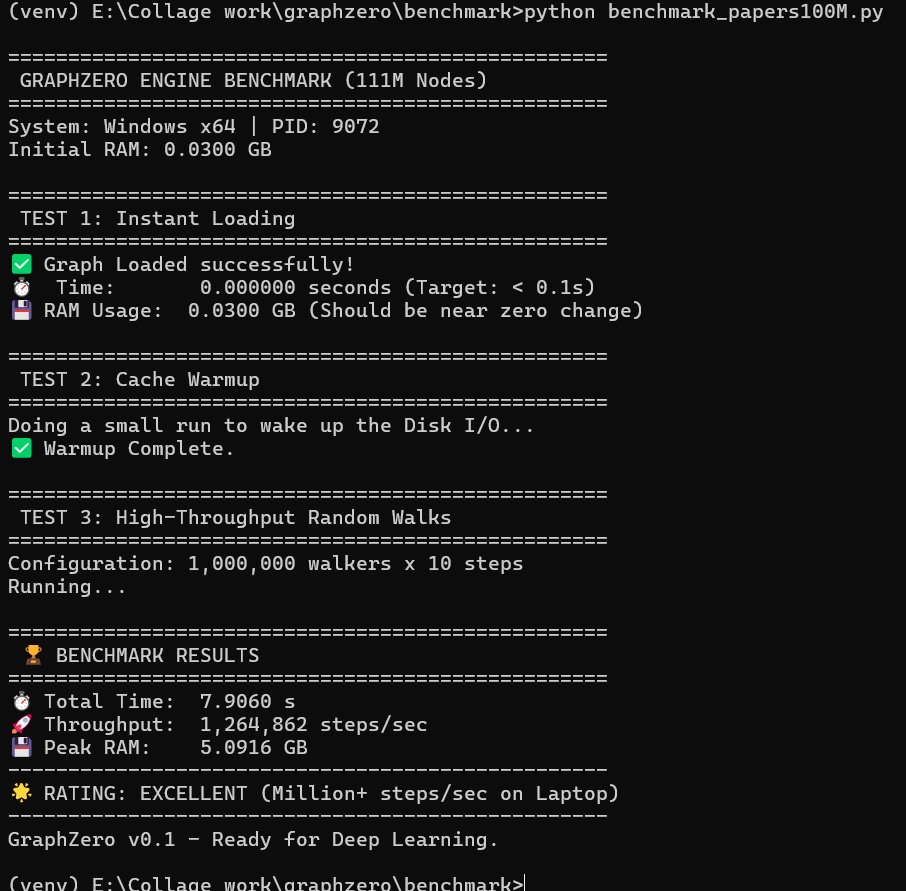
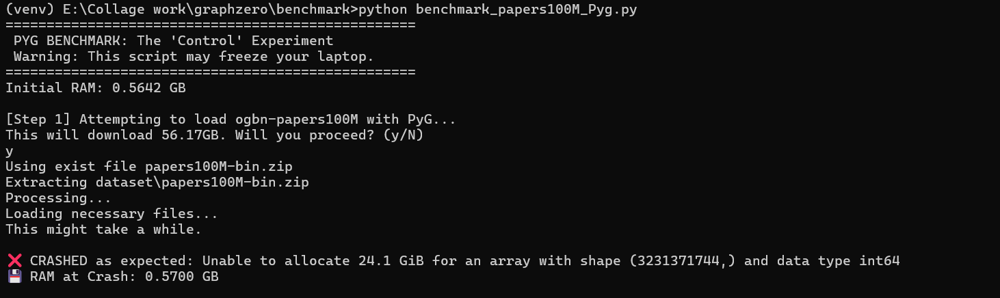

# GraphZero

**High-Performance, Zero-Copy Graph Engine for Massive Datasets on Consumer Hardware.**

GraphZero is a C++ graph processing engine with lightweight Python bindings designed to solve the **"Memory Wall"** in Graph Neural Networks (GNNs). It allows you to load and sample **100 Million+ node graphs** (like `ogbn-papers100M`) and their massive feature matrices on a standard 16GB RAM laptop—something standard libraries like PyTorch Geometric (PyG) or DGL cannot do.

## The Problem

GNN datasets can be massive. `ogbn-papers100M` contains **111 Million nodes**, **1.6 Billion edges**, and gigabytes of node embeddings.

* **Standard approach (PyG/NetworkX):** Tries to load the entire graph structure and all node features into **RAM** before training begins.
* **The Result:** `MemoryError` (OOM) on consumer hardware. You need 64GB+ **RAM** servers just to *load* the data.

## The Solution:

GraphZero abandons the "Load-to-RAM" model. Instead, it uses a custom **Zero-Copy Architecture**:

* **Memory Mapping (`mmap`):** The graph and its features stay on disk. The OS only loads the specific "hot" pages needed for computation into RAM via page faults.
* **Compressed CSR (`.gl`):** A custom binary format that compresses raw edges by **~60%** (30GB CSV $\to$ 13GB Binary).
* **Columnar Tensor Store (`.gd`):** A raw, C-contiguous binary format for node features that instantly translates to PyTorch tensors without memory allocation.
* **Parallel Sampling:** OpenMP-accelerated random walks that saturate NVMe SSD throughput, using thread-local RNGs to eliminate lock contention.

## 🏆 Benchmarks: GraphZero vs. PyTorch Geometric

**Task:** Load `ogbn-papers100M` (56GB Raw) and perform random walks.
**Hardware:** Windows Laptop (16GB RAM, NVMe SSD).

| Metric | GraphZero (v0.2) | PyTorch Geometric |
| --- | --- | --- |
| **Load Time** | **0.000000 s** ⚡ | **FAILED** (Crash) ❌ |
| **Peak RAM Usage** | **~5.1 GB** (OS Cache) | **>24.1 GB** (Required) |
| **Throughput** | **1,264,000 steps/s** | N/A |
| **Status** | ✅ **Success** | ❌ **OOM Error** |

### Proof of Performance

> *Left: GraphZero loading instantly and utilizing OS Page Cache. Right: PyG crashing with `Unable to allocate 24.1 GiB`.*

<p float="left ">


</p>


## 📦 Installation

GraphZero is available on PyPI:

```bash
pip install graphzero

```


## 🚀 Quick Start

### 1. Convert Your Data (Topology & Features)

GraphZero uses high-efficiency binary formats. Convert your generic CSV lists once.

example `edges.csv`, weights are optional:
```csv
src,dst,weight
0,1,0.5
1,2,1.0
```

```python
import graphzero as gz

# 1. Convert Topology (Edges & Weights) to .gl
gz.convert_csv_to_gl(
    input_csv="dataset/edges.csv", 
    output_bin="graph.gl", 
    directed=True
)

# 2. Convert Node Features to .gd (Float32, Int64, etc.)
gz.convert_csv_to_gd(
    csv_path="dataset/features.csv",
    out_path="features.gd",
    dtype=gz.DataType.FLOAT32
)

```

### 2. High-Speed Sampling & Zero-Copy Tensors

Once converted, the graph and its multi-gigabyte feature matrix are instantly accessible without consuming RAM.

```python
import graphzero as gz
import numpy as np

# TOPOLOGY
# Zero-Copy Load (Instant)
g = gz.Graph("graph.gl")

# Define Start Nodes
start_nodes = np.random.randint(0, g.num_nodes, 1000).astype(np.uint64)

# Parallel Biased Random Walk (Node2Vec style: p=1.0, q=0.5)
walks = g.batch_random_walk(
    start_nodes=start_nodes, 
    walk_length=10,
    p=1.0, 
    q=0.5
)

# FEATURES
# Zero-Copy Feature Load (Instant)
fs = gz.FeatureStore("features.gd")

# Get a perfect 2D Numpy/PyTorch Tensor mapping directly to the SSD
# RAM used: 0 Bytes!
node_features = fs.get_tensor() 

print(f"Graph loaded. Feature Matrix Shape: {node_features.shape}")

```

## ⚙️ Under the Hood

GraphZero is built for **Systems & GNN** enthusiasts.

* **Core:** C++20 with `nanobind` for Python bindings.
* **Parallelism:** Uses `#pragma omp` with thread-local deterministic RNGs.
* **IO:** Direct `CreateFileMapping` (Windows) and `mmap` (Linux) calls with alignment optimization (4KB/2MB pages).

## 🌟 Current Features List (v0.2)

GraphZero currently supports the following high-performance ML capabilities:

**Graph Structural Engine**

* **Instant Ingestion:** Fast `mmap`-backed loading of directed, undirected, and weighted graphs.
* **Zero-Copy CSR:** Custom `.gl` binary format for dense, continuous memory alignment and 64-byte CPU cache line optimization.
* **Thread-Safe Sampling:** OpenMP-accelerated `batch_random_walk_uniform` and `batch_random_fanout`.
* **Biased Walks (Node2Vec):** Hardware-optimized Alias Table generation for $O(1)$ weighted sampling (`batch_random_walk` with `p` and `q` parameters).
* **Fault-Tolerant:** Automatic handling of dead-ends (sinks) and out-of-bounds nodes.

**Graph Data Engine**

* **Columnar Tensor Store:** Custom `.gd` binary format for storing $N \times F$ feature matrices.
* **Strong Typing:** Native C++ template dispatching supporting `FLOAT32`, `FLOAT64`, `INT32`, and `INT64`.
* **Zero-Copy Bridge:** Direct translation of `mmap` pointers to Numpy/PyTorch multidimensional arrays.

# 🗺️ Roadmap
- v0.3 (The Algorithmic Core): High-performance analytics engine adding OpenMP-accelerated Parallel BFS/DFS, PageRank, and Connected Components.

- v0.4 (Dynamic Updates): Breaking the immutable CSR barrier via an LSM-Tree/Adjacency List memory overlay to allow real-time edge/node insertions.

- v0.5 (Production Hardening): ACID-compliant safety for multi-process PyTorch training using Reader-Writer Locks, Write-Ahead Logging (WAL), and graceful exception handling.

## 📄 License

MIT License. Created by **Krish Singaria** (IIT Mandi).